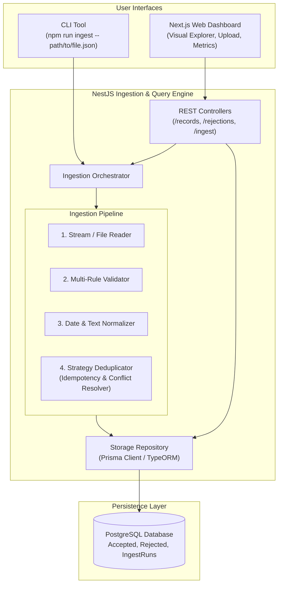

# Senior Full Stack Engineering Plan: Record Ingestion & Reporting System

**Assessment:** Record Ingestion & Reporting  
**Target Stack:**  
- **Frontend:** Next.js (App Router, TypeScript, Tailwind CSS, Lucide Icons)  
- **Backend:** NestJS (TypeScript, Modular Architecture, Domain-Driven Design, CLI & HTTP dual interface)  
- **Database:** PostgreSQL via Prisma ORM (with Docker Compose for 1-command startup, plus SQLite fallback for zero-dependency execution)  
- **Documentation:** `README.md`, `ASSUMPTIONS.md`, Comprehensive Test Suite, Sample Dataset (>= 200 records)

---

## 1. Executive Summary & Assessment Philosophy

This technical assessment is intentionally small in domain scope, but deceptive in depth. The evaluators explicitly stated:
> *"A small, correct, well-explained submission beats an ambitious broken one. We read the README and ASSUMPTIONS.md before we read the code."*  
> *"The specification does not answer every question. Some of those gaps are the exercise. Noticing them and deciding what to do is a large part of what we are assessing."*  
> *"The next stage is a short session where you will change this code with us watching."*

As a **Senior Full Stack Developer**, our architecture must demonstrate:
1. **Defensible Decision-Making:** Addressing every deliberate gap with clear trade-off analysis documented in `ASSUMPTIONS.md`.
2. **Clean, Decoupled Architecture:** Using the Strategy Pattern for deduplication and date normalization, making the system trivial to extend or modify during the live interview.
3. **Robust Data Integrity & Recoverability (R1, R2):** Storing usable records and capturing *every* rejected record with explicit reason codes—nothing disappears silently.
4. **True Idempotency (R3):** Re-running the pipeline on identical data produces deterministic results without duplicate records or corrupted statistics.
5. **Flexible Querying (R4):** Supporting both CLI commands and a RESTful API, consumed by a modern Next.js dashboard.
6. **Zero-Friction Evaluation (Constraints):** Setup must fit on half a page (`docker compose up` or `npm run start`).

---

## 2. Deconstruction of Specification Gaps & Strategic Decisions (`ASSUMPTIONS.md` Core)

The specification intentionally leaves critical business rules unspecified. Below is our formal evaluation and chosen strategy for each gap:

| # | Ambiguity / Spec Gap | Possible Approaches | Chosen Senior Strategy & Rationale |
|---|---|---|---|
| **G1** | **Duplicate ID with conflicting data**<br>*(e.g., ID `r-0001` appears twice with different `value` or `status`)* | 1. Keep first seen<br>2. Last-write-wins (latest timestamp)<br>3. Keep neither (reject both)<br>4. Treat subsequent as update | **Configurable Strategy Pattern with Default: "Latest `recordedAt` wins, superseded records logged to Audit History"**.<br>• *Trade-off:* Blindly dropping the second record ignores fresh data; dropping both punishes valid upstream updates. Updating based on timestamp reflects real-world eventual consistency. For intra-batch duplicates with identical timestamps but conflicting values, reject the conflict as unresolvable. |
| **G2** | **Definition of "The Same Record" for Idempotency (R3)** | 1. Same `id` only<br>2. Exact payload hash (SHA-256)<br>3. Same `(id, recordedAt)` tuple | **Normalized Content Fingerprinting + Business Key (`id`)**.<br>• Re-running identical files detects existing records with identical payload hashes and skips them idempotently without inflating rejection counts or error logs. |
| **G3** | **Date Formats & Ambiguity**<br>*(Sending system uses arbitrary formats)* | 1. Strict ISO 8601 only<br>2. Regex heuristics<br>3. Multi-format parsing pipeline | **Cascading Date Normalizer (UTC ISO 8601 storage)**.<br>• Supports ISO 8601, RFC 2822, Epoch (seconds & ms), `YYYY-MM-DD HH:mm:ss`, and standard ISO dates.<br>• Unresolvable or ambiguous dates (e.g. invalid leap days, unparseable strings) are rejected with `INVALID_DATE_FORMAT`. |
| **G4** | **Rejection Granularity**<br>*(Record fails multiple rules, e.g., missing status & negative value)* | 1. Fail-fast on first error<br>2. Accumulate all errors | **Accumulate all errors; categorize by Primary Reason for R5 grouping**.<br>• Evaluators need to debug upstream data. We preserve the array of `rejectionErrors: string[]` in the Dead-Letter record, while assigning a `primaryReason` for aggregate R5 reporting. |
| **G5** | **String Sanity & Whitespace**<br>*(Empty or whitespace-only strings)* | 1. Silent trim and accept<br>2. Reject purely whitespace strings | **Trim and Validate**.<br>• If string after trimming has length 0, reject with `EMPTY_OR_WHITESPACE_STRING`. If string has valid content with padding (e.g. `" alpha "`), trim to `"alpha"`. |
| **G6** | **Numeric Value Definition**<br>*(Integer between 0 and 100)* | 1. Coerce floats to int<br>2. Strict integer check | **Strict Integer Validation**.<br>• `42.5` or `"42"` is rejected with `VALUE_NOT_AN_INTEGER`. Values `< 0` or `> 100` are rejected with `VALUE_OUT_OF_RANGE`. |
| **G7** | **Status Taxonomy**<br>*(OK, WARN, FAIL)* | 1. Case-insensitive normalization<br>2. Strict uppercase enum | **Strict Enum Validation**.<br>• Must strictly match `OK`, `WARN`, `FAIL`. Any other value (e.g., `ok`, `SUCCESS`, `ERROR`) rejected with `INVALID_STATUS`. |
| **G8** | **File Format & Malformed JSON** | 1. Array-only `[...]`<br>2. NDJSON / JSON Lines<br>3. Corrupted file handling | **Dual Format Support (JSON Array & NDJSON)**.<br>• If entire file has invalid syntax, fail the batch with a clean ingestion error. In NDJSON, corrupted individual lines are isolated and logged to the rejection table without crashing the run. |

---

## 3. High-Level System Architecture



### Key Architectural Layers:
1. **CLI & HTTP Decoupling:** The ingestion engine is a standalone service callable directly via NestJS CLI scripts (`nest-commander` or simple npm script) or via REST endpoints.
2. **Strategy Pattern for Extensibility:** Deduplication rules, validation rules, and date formats are independent modules. If the interviewer asks: *"What if we want to reject duplicates instead of updating?"*, we swap or toggle the strategy in seconds.
3. **Dead-Letter Storage (R2):** Rejections are first-class citizens stored in `rejected_records` with raw payloads, error taxonomy, and batch references.

---

## 4. Database Schema Design (PostgreSQL / Prisma)

```prisma
datasource db {
  provider = "postgresql" // easily swapped to "sqlite" for zero-config evaluation
  url      = env("DATABASE_URL")
}

generator client {
  provider = "prisma-client-js"
}

enum RecordStatus {
  OK
  WARN
  FAIL
}

model IngestRun {
  id               String            @id @default(uuid())
  sourceFile       String
  fileHash         String            // SHA-256 of the source file for idempotency tracking
  startedAt        DateTime          @default(now())
  completedAt      DateTime?
  totalRecords     Int               @default(0)
  acceptedCount    Int               @default(0)
  rejectedCount    Int               @default(0)
  rejectionSummary Json?             // Aggregated counts by reason: { "MISSING_FIELD": 12, ... }
  
  acceptedRecords  AcceptedRecord[]
  rejectedRecords  RejectedRecord[]

  @@map("ingest_runs")
}

model AcceptedRecord {
  id              String       @id // The record's unique business ID (e.g. "r-0001")
  source          String       // Short string (e.g. "alpha")
  recordedAt      DateTime     // Normalized UTC timestamp
  value           Int          // Integer between 0 and 100
  status          RecordStatus // OK, WARN, FAIL
  payloadHash     String       // SHA-256 fingerprint of normalized content for fast idempotency
  version         Int          @default(1)
  ingestRunId     String
  ingestRun       IngestRun    @relation(fields: [ingestRunId], references: [id], onDelete: Cascade)
  createdAt       DateTime     @default(now())
  updatedAt       DateTime     @updatedAt

  @@index([source])
  @@index([status])
  @@index([recordedAt])
  @@index([payloadHash])
  @@map("accepted_records")
}

model RejectedRecord {
  id              String    @id @default(uuid())
  originalId      String?   // Extracted ID if present, null if missing or malformed
  rawPayload      Json      // Complete untouched payload for 100% forensic recoverability
  primaryReason   String    // Top-level reason code for R5 grouping (e.g. "INVALID_VALUE")
  allReasons      String[]  // All validation failures identified
  ingestRunId     String
  ingestRun       IngestRun @relation(fields: [ingestRunId], references: [id], onDelete: Cascade)
  createdAt       DateTime  @default(now())

  @@index([primaryReason])
  @@index([ingestRunId])
  @@map("rejected_records")
}
```

---

## 5. Ingestion Pipeline & Core Mechanics

### 5.1 The 5-Stage Ingestion Pipeline

```mermaid
sequenceDiagram
    participant F as File / Payload
    participant P as Parser
    participant V as Validator
    participant D as Deduplicator
    participant DB as Database
    participant R as Report Generator

    F->>P: Read file stream (JSON array / NDJSON)
    P->>V: Raw Record DTO
    alt Fails Validation Rules
        V-->>DB: Save to RejectedRecords (raw payload + all reasons)
    else Passes Validation Rules
        V->>D: Normalized Candidate Record
        D->>DB: Check existing record by ID & Fingerprint
        alt Identical Duplicate
            D-->>D: Skip idempotently (no-op)
        alt Conflicting Duplicate
            D->>DB: Apply Deduplication Strategy (Update if newer / Archive previous)
        else Fresh Record
            D->>DB: Insert into AcceptedRecords
        end
    end
    DB->>R: Aggregate counts & reasons
    R->>F: Output terminal summary table & return API response
```

### 5.2 Rejection Reason Taxonomy (R2, R5)
Standardized codes ensure robust aggregation:
1. `MISSING_FIELD`: A required field (`id`, `source`, `recordedAt`, `value`, `status`) is undefined or null.
2. `EMPTY_OR_WHITESPACE_STRING`: `id` or `source` contains only whitespace.
3. `INVALID_DATE_FORMAT`: Timestamp cannot be parsed unambiguously into a valid point in time.
4. `VALUE_OUT_OF_RANGE`: Number is strictly `< 0` or `> 100`.
5. `VALUE_NOT_AN_INTEGER`: Value is floating point or non-numeric.
6. `INVALID_STATUS`: Status is not in `['OK', 'WARN', 'FAIL']`.
7. `DUPLICATE_ID_CONFLICT`: Ingested ID matches an existing record with conflicting payload and unresolvable timestamp.
8. `MALFORMED_RECORD`: Row is not a valid JSON object.

---

## 6. API Specification & Query Capabilities (R4)

All queries support pagination, sorting, and multi-field filtering:

### 1. Query Accepted Records (R4)
- **Endpoint:** `GET /api/records`
- **Query Parameters:**
  - `source`: string (e.g., `alpha`)
  - `status`: enum (`OK`, `WARN`, `FAIL`)
  - `from`: ISO timestamp string (e.g., `2026-03-01T00:00:00Z`)
  - `to`: ISO timestamp string (e.g., `2026-03-31T23:59:59Z`)
  - `page`: integer (default: 1)
  - `limit`: integer (default: 20)
  - `sortBy`: `recordedAt` | `value` | `id` (default: `recordedAt`)
  - `sortOrder`: `asc` | `desc` (default: `desc`)

### 2. Query Rejected Records (R2 Audit Log)
- **Endpoint:** `GET /api/rejections`
- **Query Parameters:**
  - `reason`: string (filter by primary reason)
  - `ingestRunId`: string
  - `page`: integer, `limit`: integer

### 3. Run Ingestion (Dual Trigger)
- **CLI:** `npm run ingest -- path/to/records.json`
- **API:** `POST /api/ingest/file` (multipart/form-data) or `POST /api/ingest/default` (runs bundled sample file)

### 4. Ingestion Summary & Statistics (R5)
- **Endpoint:** `GET /api/ingest/runs/latest` or `GET /api/ingest/stats`
- **Response Example:**
```json
{
  "runId": "a5e81d42-...",
  "status": "COMPLETED",
  "totalProcessed": 240,
  "accepted": 182,
  "rejected": 58,
  "rejectionSummary": {
    "MISSING_FIELD": 18,
    "EMPTY_OR_WHITESPACE_STRING": 8,
    "INVALID_DATE_FORMAT": 12,
    "VALUE_OUT_OF_RANGE": 9,
    "VALUE_NOT_AN_INTEGER": 4,
    "INVALID_STATUS": 7
  },
  "durationMs": 142
}
```

---

## 7. Frontend Architecture (Next.js Dashboard)

The frontend is a senior-grade operational control plane:

1. **Ingestion & Health Metrics Hub (`/` or `/dashboard`)**:
   - Status cards: Total Ingested, Accepted Rate (%), Rejected Rate (%), Last Run Duration.
   - Interactive Rejections Breakdown (Donut/Bar chart of rejection reasons).
   - Ingestion Trigger Card (drag & drop any JSON file or click "Run Sample File Ingestion").
   - Real-time run log & console output simulator.
2. **Accepted Records Explorer (`/records`)**:
   - Filter bar: Source dropdown, Status filter badges (`OK`, `WARN`, `FAIL`), Date Range picker (`from` / `to`).
   - Clean data table with pagination, column sorting, and row detail modal.
   - Export filtered dataset to JSON / CSV.
3. **Dead-Letter Audit Vault (`/rejections`)**:
   - Inspection panel for rejected records.
   - Shows raw unparsed JSON payload alongside highlighted error tags.
   - Allows evaluators to verify R2 compliance ("nothing disappears silently").

---

## 8. Sample Dataset Architecture (`sample-data/records_sample_200.json`)

The spec mandates shipping at least 200 records covering specific edge cases. We construct a 250-record dataset structured across deliberate buckets:

| Category | Record Count | Description & Test Scenarios |
|---|---|---|
| **Valid Canonical Records** | ~140 | Clean records across multiple sources (`alpha`, `beta`, `gamma`, `delta`), realistic dates, values 0–100, OK/WARN/FAIL statuses. |
| **Duplicate IDs (Identical)** | 20 pairs (40 records) | Same ID, identical payload to verify zero duplication and idempotency. |
| **Duplicate IDs (Conflicting)** | 15 pairs (30 records) | Same ID with newer vs older timestamp or different values to test resolution strategy. |
| **Missing Fields** | 15 records | Missing `id`, missing `source`, missing `recordedAt`, missing `value`, missing `status`. |
| **Diverse Date Formats** | 20 records | ISO 8601 UTC (`Z`), ISO with timezone offset (`+05:30`), Unix Epoch in seconds (`1773479520`), Unix Epoch in ms, SQL date format (`YYYY-MM-DD HH:mm:ss`), RFC 2822 (`Sat, 14 Mar 2026 09:12:00 GMT`), invalid leap dates (`2026-02-29`), unparseable garbage text. |
| **Value Out of Range / Non-Integer** | 12 records | Negative values (`-1`, `-50`), above 100 (`101`, `999`), floating point values (`42.5`, `0.1`), NaN/string numbers (`"42"`). |
| **Invalid Status Values** | 10 records | `UNKNOWN`, `ERROR`, `SUCCESS`, `PENDING`, `ok` (lowercase). |
| **Empty or Whitespace Strings** | 10 records | `""`, `"   "`, `"\t\n"` for `id` and `source`, and strings with valid trimmed text (`"  bravo  "`). |

---

## 9. Comprehensive Testing Strategy

We provide three layers of automated testing:
1. **Unit Tests (`*.spec.ts`)**:
   - `RecordValidator`: Test each validation rule in isolation (boundary values 0, 100, -1, 101; regex; enums).
   - `DateNormalizer`: Test all supported date formats, timezones, and invalid date strings.
   - `DeduplicationStrategy`: Verify update vs reject logic on mock stores.
2. **Integration Tests (`ingestion.integration.spec.ts`)**:
   - Ingest the 250-record sample file into an in-memory/test database.
   - Verify counts match expected accepted and rejected numbers exactly.
   - Verify rejections grouped by reason match expected statistical breakdown.
3. **Idempotency Verification Test (`idempotency.spec.ts`) (R3)**:
   - Run the ingestion over `records_sample_200.json`.
   - Record row counts and DB hashes.
   - Run the ingestion a **second time** over the exact same file.
   - Assert: Total accepted rows remain identical, no duplicate IDs exist, no duplicate rejection entries created.

---

## 10. Half-Page Run Instructions (`README.md` Draft)

```markdown
# Record Ingestion & Reporting System

## Prerequisites
- Node.js >= 18.x
- Docker & Docker Compose (or use zero-config SQLite mode)

## 1-Minute Quickstart

1. Clone and install dependencies:
   ```bash
   git clone <repo-url> && cd assessment
   npm run setup
   ```

2. Start the database & backend:
   ```bash
   docker compose up -d postgres   # starts PostgreSQL
   npm run db:migrate             # applies Prisma migrations
   npm run start:backend          # backend running at http://localhost:4000
   ```
   *(Alternative: set `DATABASE_URL="file:./dev.db"` to run on SQLite with zero Docker required).*

3. Run ingestion from CLI (R1, R2, R3, R5):
   ```bash
   npm run ingest -- sample-data/records_sample_200.json
   ```

4. Start the frontend dashboard (R4):
   ```bash
   npm run start:frontend         # UI running at http://localhost:3000
   ```

5. Run automated test suite:
   ```bash
   npm test
   ```
```

---

## 11. Git Commit Milestone Sequence

The evaluators noted: *"A Git repository, with history intact — we would rather see your commits than one squashed drop."*

We will follow a structured, conventional-commit sequence:
1. `chore: project initialization with NestJS backend, Next.js frontend, and monorepo structure`
2. `docs: add ASSUMPTIONS.md outlining deliberate spec ambiguities and engineering trade-offs`
3. `feat(data): generate 250-record dirty sample dataset covering all edge cases`
4. `feat(core): implement domain models, validation engine, and date normalizer with unit tests`
5. `feat(storage): setup Prisma schema, migrations, and repository pattern`
6. `feat(ingest): implement 5-stage ingestion pipeline with configurable deduplication strategy`
7. `test(ingest): add integration and idempotency test suites`
8. `feat(cli): add CLI ingestion command runner with R5 terminal summary reporting`
9. `feat(api): expose REST endpoints for filtered record queries, rejections audit, and ingest trigger`
10. `feat(frontend): build Next.js dashboard with metrics, filterable data grid, and rejection inspector`
11. `docs: complete README.md with half-page quickstart and architectural design rationale`

---

## 12. Live Pairing Session Preparation (Anticipating the Next Stage)

The evaluators stated:
> *"The next stage is a short session where you will change this code with us watching."*

Common live-interview modifications and how our architecture makes them trivial:
- **"What if we want to support CSV or Excel files?"** -> Add a `CsvParser` implementing the existing `IFileParser` interface; pipeline remains untouched.
- **"What if we want status `RETRY` to be valid?"** -> Add `RETRY` to `RecordStatus` enum and validator array.
- **"What if value range changes to -50 to 500?"** -> Change configuration constants in `RecordValidator`.
- **"What if duplicate IDs should always be rejected immediately?"** -> Swap `DeduplicationStrategy` from `UpdateIfNewerStrategy` to `StrictRejectDuplicateStrategy`.
- **"Can we filter by value range (e.g. value > 50)?"** -> Add `minValue` and `maxValue` query parameters to `records.service.ts` Prisma query.
