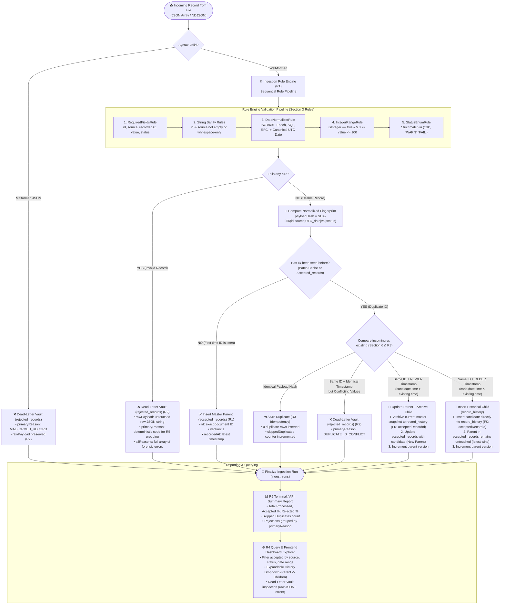
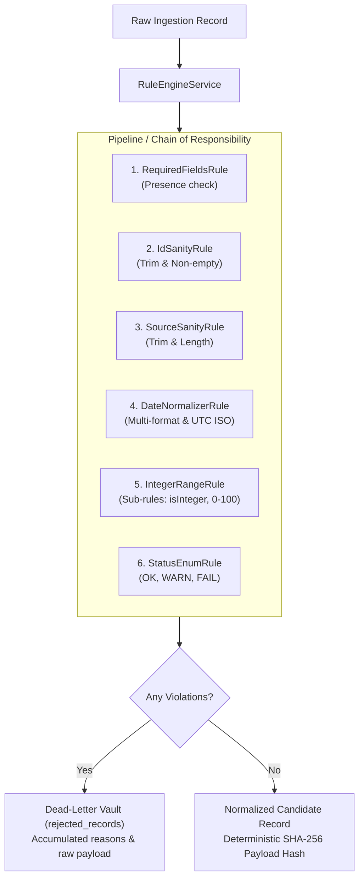
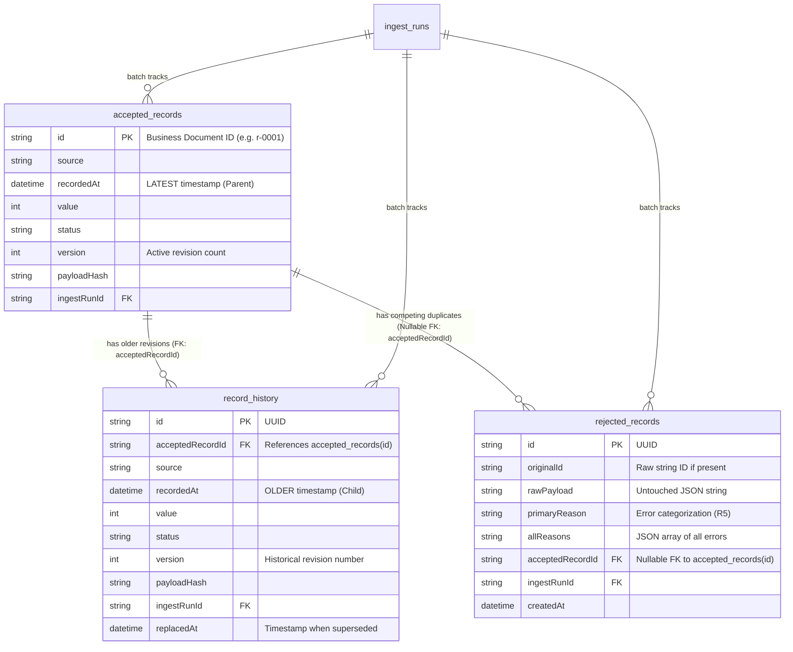

# Technical Architecture: Ingestion Rule Engine & Record History System

**Author:** Senior Full-Stack Engineering  
**Project:** Record Ingestion & Reporting System  
**Status:** Approved for Implementation  
**Location:** `/doc/RULE_ENGINE_AND_RECORD_HISTORY_PLAN.md`

---

## 1. Executive Summary & Problem Statement

### 1.1 The Problems Addressed
1. **Messy Monolithic Validation:**  
   Standard validation logic frequently devolves into sprawling, nested `if/else` checks within a single service. This violates the **Single Responsibility Principle (SRP)** and makes adding or modifying validation rules fragile and bug-prone.
2. **Loss of Historical Audit on Duplicate Updates:**  
   When an incoming record shares an existing ID with a newer timestamp, updating the active record in-place destroys previous state unless an explicit revision history is maintained.
3. **Preparedness for Live Interview Challenges:**  
   The assessment explicitly warns:
   > *"The next stage is a short session where you will change this code with us watching."*  
   A modular Rule Engine enables introducing new business rules or modifying constraints in under 60 seconds with zero risk of breaking existing rules (adhering strictly to the **Open/Closed Principle**).

---

## 2. End-to-End Record Lifecycle Flowchart (PDF Requirements Mapping)

### 2.1 Visual Pictorial Flow Diagram (Text & Preview Compatible)

```text
====================================================================================================
                                      RECORD INGESTION LIFECYCLE
====================================================================================================

                             ┌───────────────────────────────┐
                             │     Incoming Raw Record       │
                             │  {"id":"r-001","value":42,...}│
                             └───────────────┬───────────────┘
                                             │
                                             ▼
                                  [ 1. Syntax Check ]
                                 /                   \
                     (Malformed Line)             (Valid JSON)
                           /                           \
                          ▼                             ▼
            ┌───────────────────────────┐     ┌───────────────────────────────────┐
            │    DEAD-LETTER VAULT      │     │       INGESTION RULE ENGINE       │
            │    (rejected_records)     │     │                                   │
            │  Reason: MALFORMED_RECORD │     │  [R1] Required Fields Check       │
            └───────────────────────────┘     │  [R2] String & Whitespace Sanity  │
                          ▲                   │  [R3] Cascading Date Normalization│
                          │                   │  [R4] Integer Bounds [0, 100]     │
                          │                   │  [R5] Status Enum (OK, WARN, FAIL)│
                          │                   └─────────────────┬─────────────────┘
                          │                                     │
                   (Fails Any Rule)                      (Passes All Rules)
                          │                                     │
                          └─────────────────────────────────────┤
                                                                ▼
                                              ┌───────────────────────────────────┐
                                              │    Normalized Candidate Record    │
                                              │    + SHA-256 Content Fingerprint  │
                                              └─────────────────┬─────────────────┘
                                                                │
                                                                ▼
                                                   [ 2. Duplicate ID Check ]
                                                  /                         \
                                         (First-Time ID)               (Duplicate ID)
                                               /                               \
                                              ▼                                 ▼
                                 ┌─────────────────────────┐      [ 3. Timestamp Comparison ]
                                 │   Insert Active Master  │     /             │             \
                                 │   (accepted_records)    │ (Same Hash) (Newer Time)    (Older Time)
                                 │   Role: PARENT (v1)     │    │              │              │
                                 └─────────────────────────┘    ▼              │              ▼
                                              ▲              [ SKIP ]          │     ┌─────────────────────────┐
                                              │          (R3 Idempotent)       │     │  Insert History Child   │
                                              │                                ▼     │    (record_history)     │
                                              │                ┌───────────────────┐ │  Role: CHILD (Older)    │
                                              │                │ 1. Archive Old    │ │  FK: acceptedRecordId   │
                                              │                │    Master to Child│ └─────────────────────────┘
                                              │                │ 2. Update Master  │
                                              └────────────────┤    with Candidate │
                                                               └───────────────────┘
```

### 2.2 Parent Master vs. Historical Child Visual Card Representation

```text
┌────────────────────────────────────────────────────────┐
│  ACTIVE MASTER RECORD (Parent Table: accepted_records) │
├───────────────────┬────────────────────────────────────┤
│ id (PK)           │ "r-0001" (Business Document ID)    │
│ source            │ "alpha"                            │
│ recordedAt        │ 2026-03-14T10:15:00Z (LATEST)     │
│ value             │ 85                                 │
│ status            │ "WARN"                             │
│ version           │ 2                                  │
└───────────────────┴──┬─────────────────────────────────┘
                       │
                       │ 1-to-Many Foreign Key Relation
                       │ (acceptedRecordId REFERENCES accepted_records.id)
                       ▼
┌────────────────────────────────────────────────────────┐
│  HISTORICAL AUDIT RECORD (Child Table: record_history) │
├───────────────────┬────────────────────────────────────┤
│ id (PK)           │ "a83f910b-..." (Internal UUID)     │
│ acceptedRecordId  │ "r-0001" (Exact Document ID) ◄─────┼── FK LINK
│ source            │ "alpha"                            │
│ recordedAt        │ 2026-03-14T10:12:00Z (OLDER)       │
│ value             │ 25                                 │
│ status            │ "OK"                               │
│ version           │ 1                                  │
│ replacedAt        │ 2026-09-10T11:40:00Z               │
└────────────────────────────────────────────────────────┘
```

### 2.3 Interactive Mermaid Flowchart (Markdown Preview)



### 2.1 PDF Requirement Mapping Table

| Flow Step | Trigger Condition | System Action & Destination | PDF Spec Requirement |
|---|---|---|---|
| **Syntax Check** | Malformed JSON line | Persist raw string into `rejected_records` | **R2:** *"Nothing disappears silently"* |
| **Rule Engine** | Clean record passing 5 rules | Compute `payloadHash`, prepare candidate | **R1:** *"Check record against rules, store ones that pass"* |
| **Rule Engine** | Rule violation (e.g. `value: -1`, `status: "ok"`) | Persist raw payload, primary reason, and all reasons to `rejected_records` | **R2:** *"Every record rejected must be recoverable with reason"* |
| **New ID** | ID never seen before | Insert into `accepted_records` as active parent | **R1:** Usable records stored |
| **Identical Duplicate** | Same ID and identical payload hash | Skip record insertion without modifying counts | **R3:** *"Running twice over same file must not duplicate anything"* |
| **Newer Duplicate** | Same ID with strictly newer `recordedAt` | Archive existing master to `record_history` (FK), update `accepted_records` | **Section 6:** Explicit trade-off (latest event timestamp wins) |
| **Older Duplicate** | Same ID with older `recordedAt` | Insert directly into `record_history` as historical child (FK) | **Section 6 & User Spec:** Master remains latest; older becomes child |
| **Conflicting Duplicate** | Same ID, exact same millisecond, different value | Reject into `rejected_records` with `DUPLICATE_ID_CONFLICT` | **R2:** Unresolvable ambiguity captured in audit vault |
| **Run Finalization** | Batch finished | Emit ASCII summary table & API response grouped by reason | **R5:** *"Report accepted/rejected counts grouped by reason"* |
| **Data Query** | User queries `/api/records` or Dashboard | Filter by `source`, `status`, `from`/`to`, and inspect history | **R4:** *"Provide a way to query what you stored"* |

---

## 3. Ingestion Rule Engine Architecture



### 2.1 Core Contracts & Interfaces

```typescript
export interface RuleContext {
  sanitizedFields: Map<string, unknown>;
  errors: string[];
}

export interface IngestionRule {
  readonly code: string;
  readonly description: string;
  readonly priority: number;
  
  /**
   * Executes rule validation against the raw record.
   * If valid, sets normalized output into context.sanitizedFields.
   * If invalid, pushes specific error code(s) to context.errors.
   */
  execute(raw: Record<string, unknown>, context: RuleContext): Promise<boolean> | boolean;
}

export interface RuleEngineResult {
  isValid: boolean;
  normalizedRecord?: NormalizedRecord;
  primaryReason?: string;
  allReasons: string[];
}
```

---

### 2.2 Built-In Rule Modules & Sub-Rules

Each rule is implemented as an isolated class with dedicated sub-rules:

| Rule Class | Rule Code | Sub-Rules & Error Conditions | Normalized Output |
|---|---|---|---|
| **`RequiredFieldsRule`** | `MISSING_FIELD` | • Check presence of `id`, `source`, `recordedAt`, `value`, `status`<br>• Flags `MISSING_FIELD` if any required key is `undefined` or `null`. | None (structural check) |
| **`IdSanityRule`** | `EMPTY_OR_WHITESPACE_STRING` | • Must be `typeof string`<br>• Trim whitespace; reject if length is 0. | `id: string` |
| **`SourceSanityRule`** | `EMPTY_OR_WHITESPACE_STRING` | • Must be `typeof string`<br>• Trim leading/trailing whitespace; reject if empty. | `source: string` (trimmed) |
| **`DateNormalizerRule`** | `INVALID_DATE_FORMAT` | • Priority cascading parse: ISO 8601 UTC/offsets, Epoch sec/ms, SQL datetime, RFC 2822, date-only.<br>• Rejects calendar impossibilities (e.g. Feb 31) and unparseable strings. | `recordedAt: Date` (canonical UTC) |
| **`IntegerRangeRule`** | `VALUE_NOT_AN_INTEGER`<br>`VALUE_OUT_OF_RANGE` | • **Sub-rule 5A (Integer Check):** Rejects floats (`42.5`), strings (`"42"`), booleans.<br>• **Sub-rule 5B (Range Check):** Rejects values $< 0$ or $> 100$. | `value: number` (integer) |
| **`StatusEnumRule`** | `INVALID_STATUS` | • Strict case-sensitive match against `['OK', 'WARN', 'FAIL']`.<br>• Rejects lowercase (`ok`), synonyms (`SUCCESS`, `ERROR`), and whitespace. | `status: 'OK'\|'WARN'\|'FAIL'` |

---

### 2.3 Live Interview Extensibility Walkthrough

**Interview Scenario:** *"We want to add a rule that values above 90 can only be sent by source 'alpha'."*

**Implementation:**
Create one standalone file `backend/src/ingestion/rules/built-in/alpha-high-value.rule.ts`:
```typescript
@Injectable()
export class AlphaHighValueRule implements IngestionRule {
  readonly code = 'INVALID_HIGH_VALUE_SOURCE';
  readonly description = 'Values above 90 are restricted to source alpha';
  readonly priority = 70;

  execute(raw: Record<string, unknown>, context: RuleContext): boolean {
    const value = context.sanitizedFields.get('value') as number;
    const source = context.sanitizedFields.get('source') as string;

    if (value > 90 && source !== 'alpha') {
      context.errors.push(this.code);
      return false;
    }
    return true;
  }
}
```
Register it in `IngestionModule`. **Existing code is untouched. Zero regression risk.**

---

## 3. Parent/Child Record History Architecture

### 3.1 Relational Schema Design



### 3.2 Prisma Schema Definition

```prisma
model AcceptedRecord {
  id              String          @id // The record's unique business ID (from incoming document)
  source          String
  recordedAt      DateTime        // Latest point in time (Parent)
  value           Int
  status          String          // "OK", "WARN", "FAIL"
  payloadHash     String
  version         Int             @default(1)
  ingestRunId     String
  ingestRun       IngestRun       @relation(fields: [ingestRunId], references: [id], onDelete: Cascade)
  createdAt       DateTime        @default(now())
  updatedAt       DateTime        @updatedAt

  // 1-to-Many Relation to Historical Revisions:
  history         RecordHistory[]

  // 1-to-Many Relation to Rejected Duplicate Collisions (Nullable FK):
  rejectedRecords RejectedRecord[]

  @@index([source])
  @@index([status])
  @@index([recordedAt])
  @@index([payloadHash])
  @@map("accepted_records")
}

model RecordHistory {
  id               String         @id @default(uuid())
  acceptedRecordId String         // Foreign Key to the Master Document ID
  acceptedRecord   AcceptedRecord @relation(fields: [acceptedRecordId], references: [id], onDelete: Cascade)
  source           String
  recordedAt       DateTime       // Historical timestamp (Child)
  value            Int
  status           String
  payloadHash      String
  version          Int
  ingestRunId      String?
  replacedAt       DateTime       @default(now())

  @@index([acceptedRecordId])
  @@index([recordedAt])
  @@map("record_history")
}

model RejectedRecord {
  id               String          @id @default(uuid())
  originalId       String?
  rawPayload       String
  primaryReason    String
  allReasons       String
  ingestRunId      String
  ingestRun        IngestRun       @relation(fields: [ingestRunId], references: [id], onDelete: Cascade)

  // Nullable Foreign Key to Competing Accepted Master Record:
  acceptedRecordId String?
  acceptedRecord   AcceptedRecord? @relation(fields: [acceptedRecordId], references: [id], onDelete: SetNull)

  createdAt        DateTime        @default(now())

  @@index([primaryReason])
  @@index([ingestRunId])
  @@index([acceptedRecordId])
  @@map("rejected_records")
}
```

---

### 3.3 Deterministic Ingestion Handling

When an incoming record arrives with an ID that already exists in the system:

```text
Incoming Record (candidate)
           │
           ▼
Compare candidate.recordedAt vs existing.recordedAt
           │
           ├─► candidate.recordedAt > existing.recordedAt (NEWER)
           │   1. Archive current master snapshot to `record_history` (FK -> candidate.id)
           │   2. Update `accepted_records` with candidate data
           │   3. Increment version
           │   4. Status: ACCEPTED (UPDATE)
           │
           ├─► candidate.recordedAt < existing.recordedAt (OLDER)
           │   1. Insert candidate directly into `record_history` (FK -> candidate.id)
           │   2. Parent remains untouched
           │   3. Increment parent version
           │   4. Status: ACCEPTED (HISTORICAL_CHILD)
           │
           ├─► candidate.recordedAt == existing.recordedAt && payloadHash matches
           │   1. Skip as idempotent no-op (R3)
           │   2. Status: SKIPPED
           │
           └─► candidate.recordedAt == existing.recordedAt && payloadHash differs
               1. Contradictory conflict at exact same millisecond
               2. Send to `rejected_records` with reason DUPLICATE_ID_CONFLICT
               3. Status: REJECTED
```

---

## 4. REST API Endpoints

### 4.1 `GET /api/records`
Returns paginated accepted records with revision count:
```json
{
  "data": [
    {
      "id": "20000000-0000-4000-8000-000000000001",
      "source": "alpha",
      "recordedAt": "2026-03-14T10:15:00.000Z",
      "value": 85,
      "status": "WARN",
      "version": 2,
      "_count": {
        "history": 1
      }
    }
  ]
}
```

### 4.2 `GET /api/records/:id/history`
Returns all historical child records for a document ID in reverse chronological order:
```json
{
  "masterId": "20000000-0000-4000-8000-000000000001",
  "history": [
    {
      "id": "e81d4fae-...",
      "acceptedRecordId": "20000000-0000-4000-8000-000000000001",
      "source": "alpha",
      "recordedAt": "2026-03-14T10:12:00.000Z",
      "value": 25,
      "status": "OK",
      "version": 1,
      "replacedAt": "2026-09-10T11:20:00.000Z"
    }
  ]
}
```

---

## 5. Frontend UI Specifications

### 5.1 Accepted Records Explorer: Expandable Revision Dropdown
In `frontend/src/app/records/page.tsx`:
* When `record._count.history > 0`, the row displays an interactive pill button:  
  👉 **`History (N versions) ▾`**
* Clicking expands an inline revision accordion showing:
  * **Active Master Record (Parent):** Highlighted with a green "Latest Master" badge.
  * **Older Revisions (Children):** Rendered in a sub-table displaying `version`, `recordedAt`, `value`, `status`, and `superseded at`.

### 5.2 Dead-Letter Vault: Competing Master Comparison Dropdown
In `frontend/src/app/rejections/page.tsx`:
* When a rejection has a foreign key to an accepted record (`rej.acceptedRecord != null`), the row displays a blue comparison badge button:  
  👉 **`Compare with Master Record ▾`**
* Expanding it renders an instant side-by-side comparison panel:
  * **Left Column:** Currently Accepted Master Record (`id`, `value`, `status`, `recordedAt`).
  * **Right Column:** Rejected Duplicate Record (`rawPayload`, failed condition, `primaryReason = DUPLICATE_ID_CONFLICT`).

---

## 6. Implementation Steps

1. **Schema Migration:**
   * Add `RecordHistory` model to `prisma/schema.prisma` with FK `acceptedRecordId -> AcceptedRecord.id`.
   * Add nullable FK `acceptedRecordId` to `RejectedRecord` model referencing `AcceptedRecord.id`.
   * Run `npx prisma db push`.
2. **Rule Engine Implementation:**
   * Create `backend/src/ingestion/rules/rule.interface.ts`.
   * Implement 6 built-in rule classes (`RequiredFieldsRule`, `IdSanityRule`, `SourceSanityRule`, `DateNormalizerRule`, `IntegerRangeRule`, `StatusEnumRule`).
   * Create `RuleEngineService` and connect to `IngestionModule`.
3. **Pipeline Integration:**
   * Route `RecordValidatorService` to `RuleEngineService`.
   * Update `IngestionService` duplicate handling:
     * Newer timestamp: archive master snapshot to `RecordHistory`, update master.
     * Older timestamp: insert directly into `RecordHistory` as child.
     * Conflicting timestamp: reject to `RejectedRecord` with `acceptedRecordId = candidate.id`.
4. **API Controller:**
   * Expose `GET /api/records/:id/history`.
   * Include `acceptedRecord: true` relation in `GET /api/rejections`.
5. **Frontend UI Dropdowns:**
   * Add revision history accordion in `frontend/src/app/records/page.tsx`.
   * Add master comparison dropdown in `frontend/src/app/rejections/page.tsx`.
6. **Testing & Verification:**
   * Run Jest test suite (`npm test`).
   * Verify parent/child rows and rejection links in PostgreSQL.

